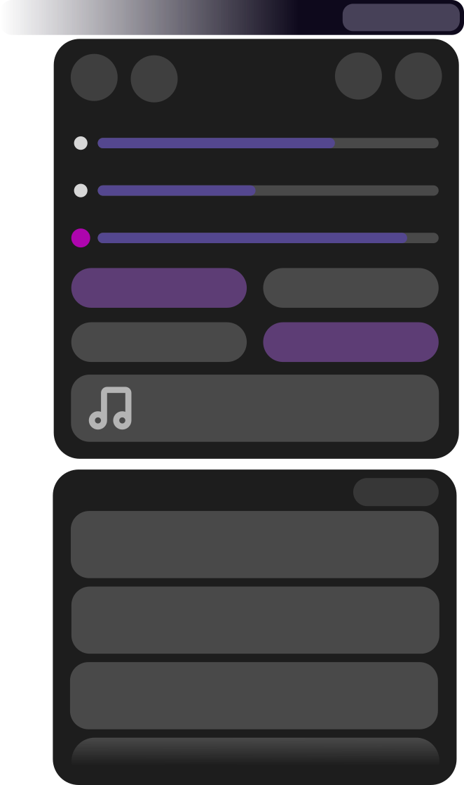
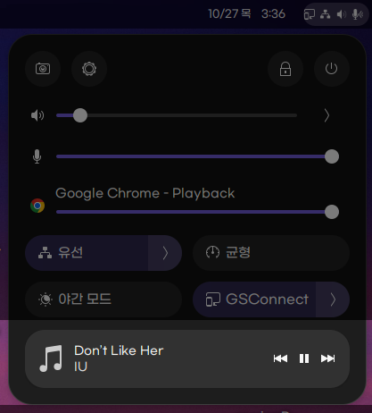

# Quick Settings Tweaker 

### Let's tweak Gnome 43 quick settings!

Quick Settings Tweaker is a Gnome 43+ extension which allows you to customize the new Quick Settings Panel to your liking!

 
 

## Features

| With this extension, you can: | How it will appear |
|:-------------------------------|:--------------------:|
| 
**Add a Volume Mixer**

To ajust the volume on a per-app basis
 |  |
| 
**Add Media Controls**

To control your music directly from the Quick Settings Panel, instead of the Notification Center
 |  |
| 
**Append a Notifications Panel** at the end of the QS Panel

Congrats! Now you really have a fully featured menu at the top right corner of your screen!
 |  |

## TODO

- [ ] Add native style notification dnd/clear option  
- [ ] Renew stylesheet  
- [ ] Renew build system  
- [ ] Fix notification scrollbar visual bug
- [ ] Fix buttonRemover bugs
- [ ] Allow user can set max height of notification
- [ ] Add option to remove styling(round / coloring etc) notification message or media control
- [ ] Change some settings (Switch => dropdown such as position of notification)
- [ ] Add option that allow notification box can be hidden when have no notifications
- [ ] Add option to remove system buttons (Remove screenshot button or more)
 