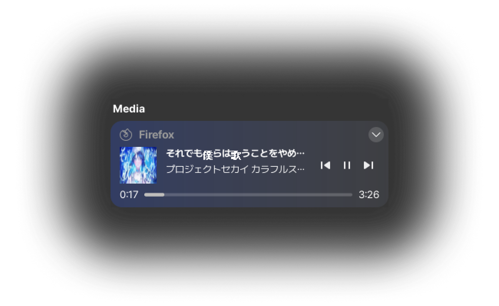
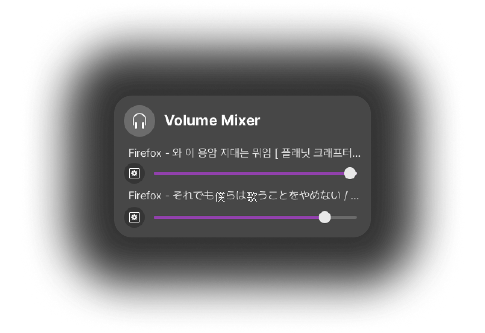
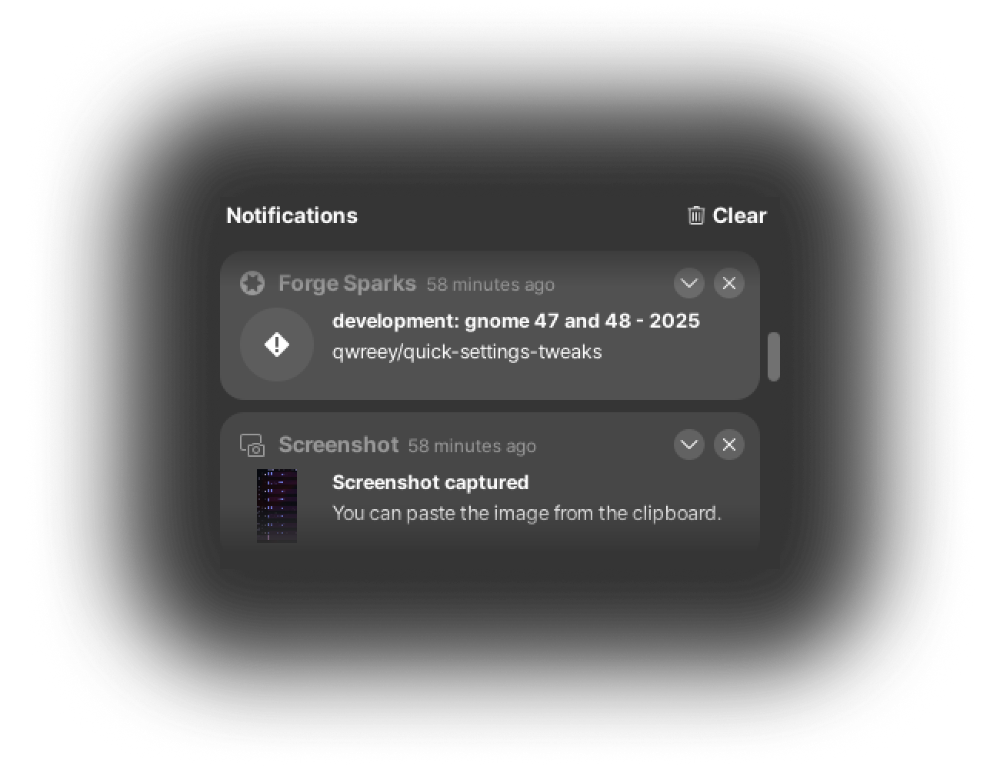
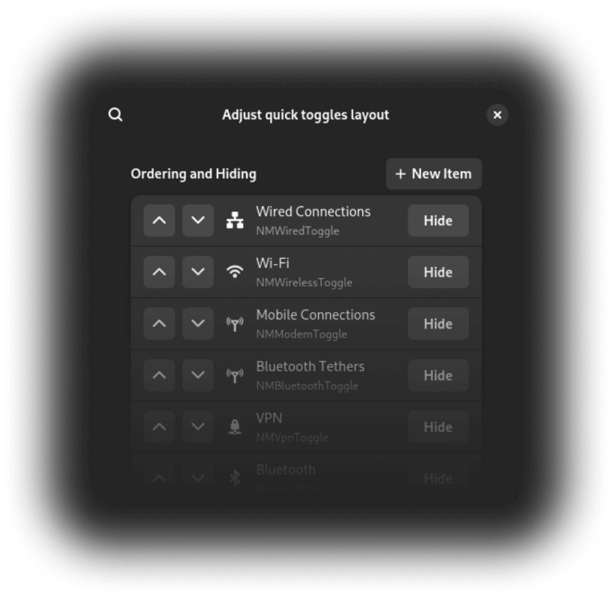
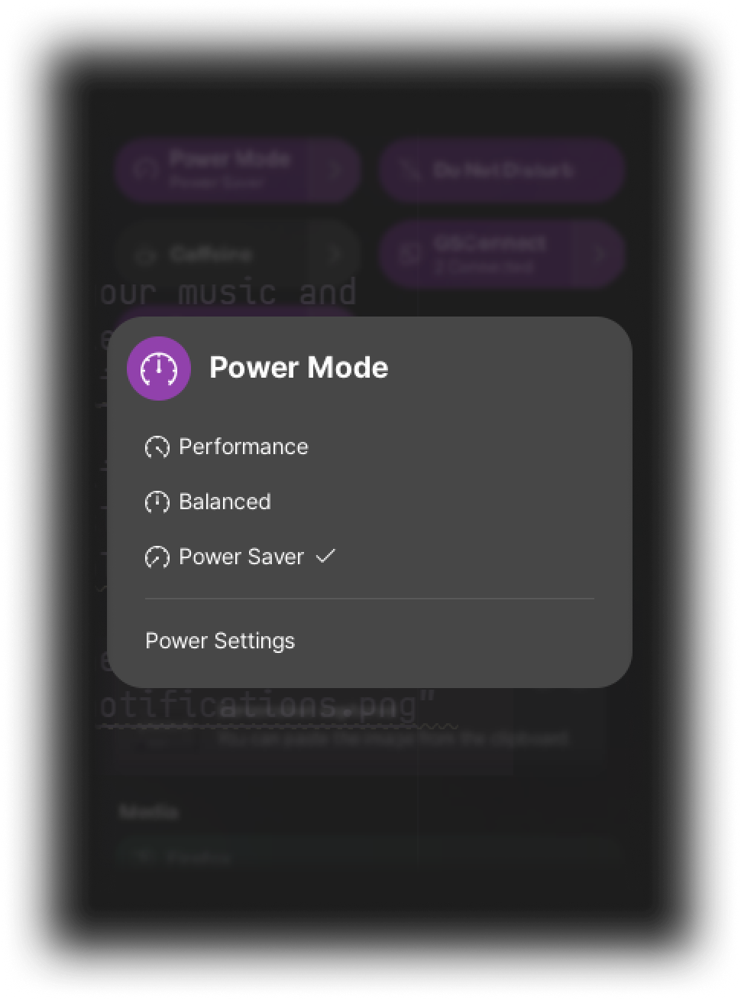
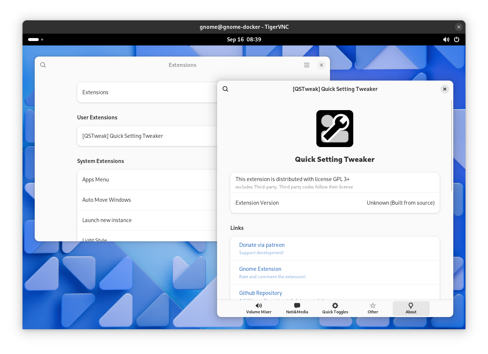

# Quick Settings Tweaker 

### Let's tweak Gnome 47 quick settings!

 
 
Quick Settings Tweaker is a Gnome 43+ extension which allows you to customize the new Quick Settings Panel to your liking!

 
 

## Features

| 
With this extension, you can...
 | How it will appear |
|:-------------------------------|:--------------------:|
| 
**Add the Media Controls Widget**

Control your music and videos directly from the Quick Settings, instead of the Date Menu.  For a cooler look, you can also get colors from the cover image and create a gradient.
 |  |
| 
**Add the Volume Mixer Widget**

Adjust application volumes, without opening extra application.  Place the menu button next to the output slider for a compact and natural layout.
 |  |
| 
**Add the Notifications Widget**

You can check what has been sent to your mailbox or messenger, without missing!
 |  |
| 
**Layout customize**

Hide, re-order, re-color your panel and Quick Settings layout  Make it simple and keep organized!
 |  |
| 
**Overlay menu layout**

Your Quick Settings panel is too big?  Try overlay layout! you can customize background and animation style too.
 |  |

## Sponsor

You can promote and support development by [github sponsor!](https://github.com/sponsors/qwreey) You can help keep this project maintained

Here is my sponsors, thank for your support!

## Development

### Translations

You can help translate this extension by open a pull request, or using [weblate](http://weblate.paring.moe/engage/gs-quick-settings-tweaks/)

### Building

> Prerequirements: You need to install nodejs, bash, and gnome-shell for compiling extension from source

You can create development build by executing `TARGET=dev ./install.sh create-release`. make sure run `npm i` first to ensure all build dependencies installed

Or, you can get nightly preview build from [github releases tab](https://github.com/qwreey/quick-settings-tweaks/releases). Build extension from `dev` branch is not encouraged, because the `dev` branch has unchecked bleeding-edge features not guaranteed to work. github-preview build is tested by developer and much stable than building `dev` branch.

### Contribution and Issues

Keep in mind that there may be one or a few developers, but there may be many issues and users. I think you know how to behave with manners without even having to say it.

#### Raise an issue

If you want to raise an issue, First, **you must search your issue first.** duplicated issue will be closed, and disturb developer's time.

Second, **you must attach a related log files, gnome version and extension version informations.** if you don't provide information much about your issue, it is hard to solve your issue.

And last, **you must use well-formed english** You can use a translator or AI to write it, so avoid wasting time by having the developer translate and take notes. This takes up a surprising amount of the developer's time, making analysis very difficult, especially if the logs are mixed in English and other languages.

#### PR and code contribution

If you want to contribute, **you must pull `dev` branch, Not master branch.** master branch is release branch, because AUR and some user distributions use master branch as build source. **If you create pull-request to master branch, it will be closed.** you should re-open PR to dev branch.

### Testing

You can test extension with command `./install.sh dev`. You will need tigervnc client and docker in host. Tested in arch linux but it should working on any systemd based platform

You can re-build extension by log out and close vnc window or send SIGINT to exit dev docker.
