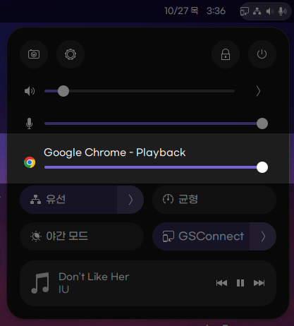
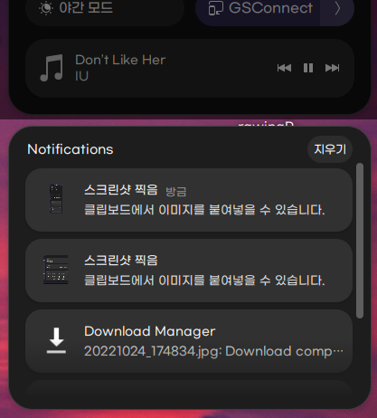

# Quick Settings Tweaker 

### Let's tweak Gnome 47 quick settings!

 
 
Quick Settings Tweaker is a Gnome 43+ extension which allows you to customize the new Quick Settings Panel to your liking!

 
 

## Features

| With this extension, you can: | How it will appear |
|:-------------------------------|:--------------------:|
| 
**Add a Volume Mixer**

To ajust the volume on a per-app basis
 |  |
| 
**Add Media Controls**

To control your music directly from the Quick Settings Panel, instead of the Notification Center
 |  |
| 
**Append a Notifications Panel** at the end of the QS Panel

Congrats! Now you really have a fully featured menu at the top right corner of your screen!
 |  |

## Translations

You can help translate this extension by open a pull request, or using [weblate](http://weblate.paring.moe/engage/gs-quick-settings-tweaks/)

## Testing

You can test extension with command `./install.sh dev`. You will need tigervnc client and docker in host. Tested in arch linux but it should working on any systemd based platform

You can re-build extension by log out and close vnc window or send SIGINT to exit dev docker.
